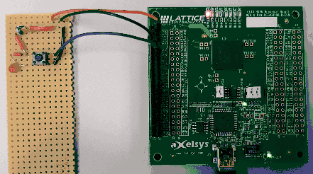
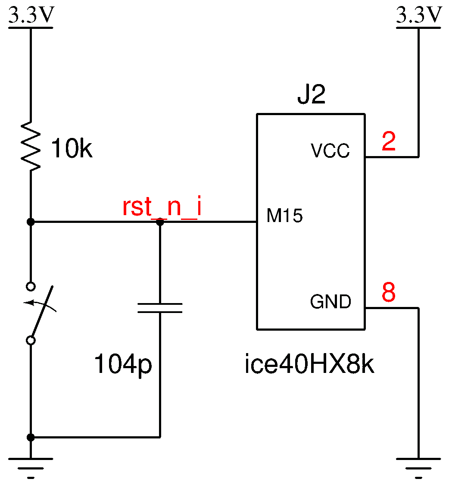
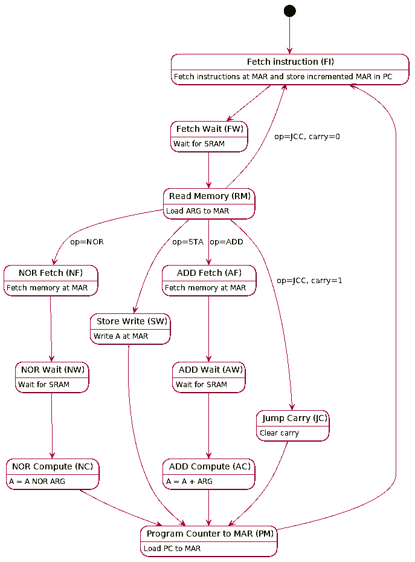

# alpacacore-soc documentation

## Overview
The SoC consists of the alpacacore CPU and a counter which records the write accesses to a specific memory location.
These memory writes are made visible on a LED, serving as a heartbeat that the CPU executes the program correctly.

## Additional circuitry
To reset the system, additional circuitry is required as shown:

## The CPU core
The CPU is rather simple, the following images present the data path and control.
The ISA is [documented separately](isa.md).

